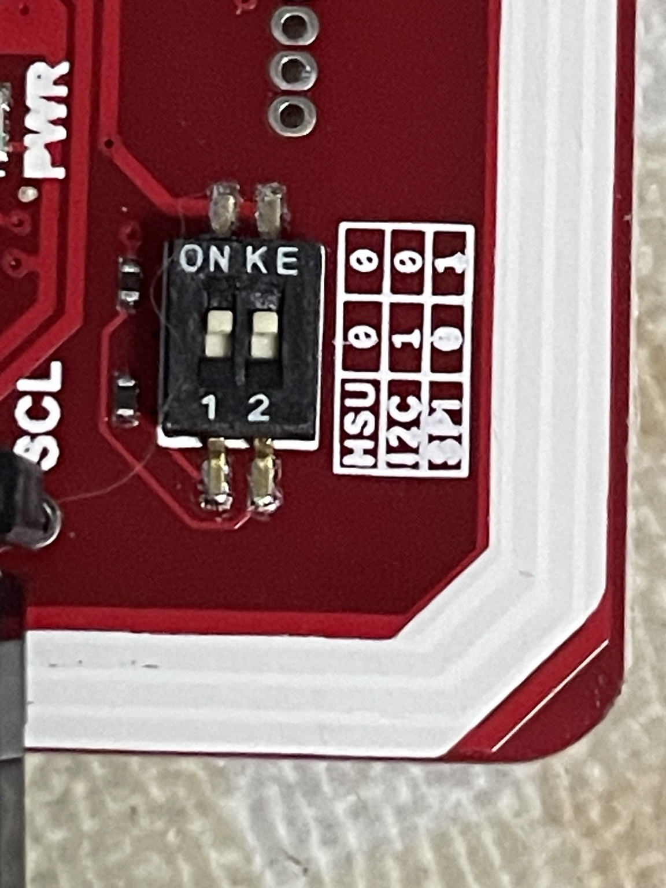

# NFCX

<strong>A cross-platform, open-source, easy-to-use GUI desktop tool for NFC.</strong>

<a href="README.md">English</a> | <a href="README.zh-CN.md">简体中文</a>

NFCX brings reader discovery, card information, reads, protected writes, raw dumps, key management, and recovery workflows into one desktop application for macOS, Windows, and Linux. It is for MIFARE Classic cards you own or are authorized to test.

NFCX is open source and uses a clear, direct GUI so NFC work does not depend on a collection of command-line tools.

Website: [nfcx.tools](https://nfcx.tools) · Downloads: [GitHub Releases](https://github.com/BennyThink/NFCX/releases)

# What NFCX can do

- Discover and connect NFC readers.
- Detect cards and show their UID, ATQA, SAK, and card type.
- Work with MIFARE Classic 1K: authenticate with Key A or Key B, read blocks, edit data, and write changes.
- Save and load compatible raw dumps (`.bin` / `.mfd`) with sidecar metadata; restore with capacity, BCC, access-bit, and per-block read-back checks.
- Scan common keys and manage a local key catalog.
- Run the integrated recovery sequence on a validated PN532 UART reader: common keys, Darkside, Nested, Hardnested, and read verification.
- Use the guarded 4-byte UID/block 0 workflow for supported CUID/Gen2 and Gen1A cards.

# Supported readers

| Reader | Connection / backend | Status | Platforms |
| --- | --- | --- | --- |
| PN532 + FT232RL | Serial, `pn532_uart` via libnfc | **Tested**: discovery, Classic read/write, dump/restore, and key recovery | macOS, Windows, Linux builds |
| Other PN532 UART adapters | Serial, `pn532_uart` via libnfc | **Expected compatible**; not hardware-tested by this project | Depends on adapter driver and serial permissions |
| ACR122U | USB / PC/SC or libnfc | **Unsupported in this release**: NFCX hardware validation and a release profile are not yet available | — |
| ACR1552U | USB / vendor PC/SC driver | **Unsupported in this release**: NFCX hardware validation and a release profile are not yet available | — |
| Other libnfc devices | Varies | **Unsupported** until an explicit NFCX validation profile exists | — |

# Drivers and runtime requirements

NFCX packages its NFC runtime. You do not need to install libnfc, mfoc, mfcuk, or separate command-line NFC tools.

- Linux: your account generally needs read/write serial access (commonly the `dialout` group). For example, run `sudo usermod -aG dialout $USER`, then sign out and back in. You can also run it with `sudo` if you understand the implications.
- macOS: an unsigned release can show a Gatekeeper warning. Use **System Settings → Privacy & Security** to allow it to open when prompted.
- Windows: starting NFCX may require the [FTDI virtual-COM/serial driver](https://ftdichip.com/drivers/).

# Download and install

1. Open [GitHub Releases](https://github.com/BennyThink/NFCX/releases).
2. Download the archive or installer for your operating system.
3. Install or unpack it, then install the reader driver if needed.
4. Connect the reader and start NFCX.

# Quick start

1. Connect an NFC reader and launch NFCX.
2. Refresh the reader list or enter the PN532 UART connection string.
3. Place an authorized card on the reader and select **Scan Card**.
4. Review the card information, then use **Key Recovery**, **Read Card**, or **Change UID** as needed.

UART/HSU config: 

# FAQ

Do I still need a card reader?

Yes. NFCX communicates with physical NFC cards through a compatible external reader.

Which hardware is supported?

The tested combination is PN532 + FT232RL. Other serial adapters may work, but FT232RL is recommended. Set the PN532 to UART/HSU mode and cross the data lines (PN532 RX to the serial adapter’s TX). A soldered connection is recommended to avoid unreliable jumper wires.

Can I write an access card to an iPhone?

NFCX can work with physical access cards, but cards in an iPhone cannot be written like ordinary blank NFC cards. Consider using a writable NFC sticker and attaching it to the back of the phone.

Which cards do you recommend?

For authorized testing, CUID cards are a useful choice. They commonly support changing the UID, and their all-FF Key A and Key B are convenient for testing.

Can I clone an access card?

It depends on the card type and access-control system design. Only work with cards and systems you own or are explicitly authorized to test.

Why can’t NFCX find my reader?

Check the serial port, adapter driver, whether another program is using the device, and whether your current system account has permission to access the serial port.

What hardware should I buy?

PN532 + FT232RL plus several CUID test cards is the currently validated starter combination.

Does it support macOS, Linux, and Windows?

Yes. NFCX is built for macOS, Windows, and Linux; reader support still depends on the tested hardware configuration.

Why can I read the UID but not change it?

Block 0, which contains the UID, is not writable by default. Only some special Gen1/Gen2 cards, such as CUID Magic Cards or some Fudan cards, allow changes; ordinary cards should not be modified.

Why does a matching UID still not open the door?

The system may check more than the UID: it may validate data in other sectors or use a rolling code. A matching UID therefore does not guarantee the same access rights.

What are Key A and Key B?

They are the two authentication keys used by each MIFARE Classic sector. Access bits determine what each key can read or write; they are not universal passwords and should not be shared carelessly.

What are Darkside and Nested?

They are key-recovery techniques for known weaknesses in some MIFARE Classic cards. NFCX only exposes the related workflows for cards and systems you own or are explicitly authorized to test.

Can I clone a car key?

It depends on the manufacturer’s design. Some systems may use NFC, but many car keys use other radio protocols, encryption, or rolling codes. Only handle devices you own or are authorized to test.

Does the software upload my data?

No card UID, keys, dumps, card contents, or personal information are uploaded. Anonymous telemetry is optional on first launch and can be disabled at any time.

Is it free and open source?

Yes. NFCX source code is released under the MIT License; third-party components included with releases are distributed under their respective licenses.

Can I use it commercially?

NFCX itself is MIT-licensed and generally permits commercial use. If you redistribute the app or its runtime components, you must also comply with the licenses of included third-party components.

Can I sponsor the project?

Yes. You can [sponsor NFCX on GitHub Sponsors](https://github.com/sponsors/BennyThink).

# Screenshots

## Main window

## Key library

# Privacy and anonymous telemetry

Anonymous telemetry is entirely optional. You can choose whether to enable it at first launch and change that choice later in **About**.
When enabled, NFCX sends only an anonymous installation identifier, NFCX version, coarse operating-system type, allowlisted feature events, and event time to understand feature usage and platform distribution.

NFCX does **not** collect card UIDs, Key A/Key B values, dumps, card contents, reader identifiers, usernames, device names, machine IDs, file paths, logs, IP addresses, or other personal information.
The collector does not retain raw request headers or IP data. See the [telemetry specification](docs/specs/14-telemetry.md) for implementation details.

# License and third-party software

NFCX source code is released under the [MIT License](LICENSE).
NFCX dynamically links LGPL-3.0-or-later libnfc and redistributes separate GPL-2.0-or-later recovery executables (mfoc, mfcuk, and mfoc-hardnested), plus the BSD-2-Clause `nfc-mfsetuid` utility.
These are independently licensed programs; release packages include their notices, source locations, pinned versions, and NFCX patches.

Read [THIRD_PARTY_NOTICES.md](THIRD_PARTY_NOTICES.md) before redistributing NFCX or its runtime.

# Project links

- [Website](https://nfcx.tools)
- [GitHub repository](https://github.com/BennyThink/NFCX)
- [Download releases](https://github.com/BennyThink/NFCX/releases)
- [Sponsor NFCX](https://github.com/sponsors/BennyThink)
- [Documentation index](docs/README.md)

# Responsible use

NFCX is intended for interoperability, research, development, backup, and authorized security testing. 
Use it only with cards and systems you own or have explicit permission to test. 
You are responsible for complying with applicable laws and regulations.

# LICENSE

MIT
