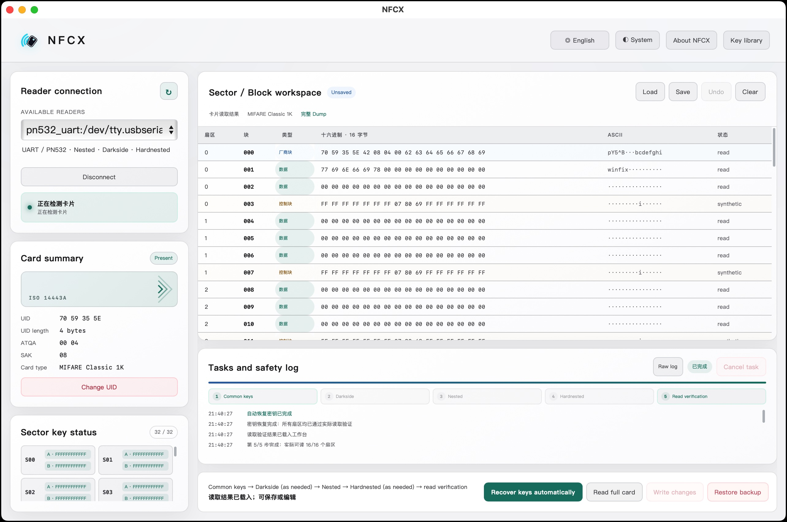
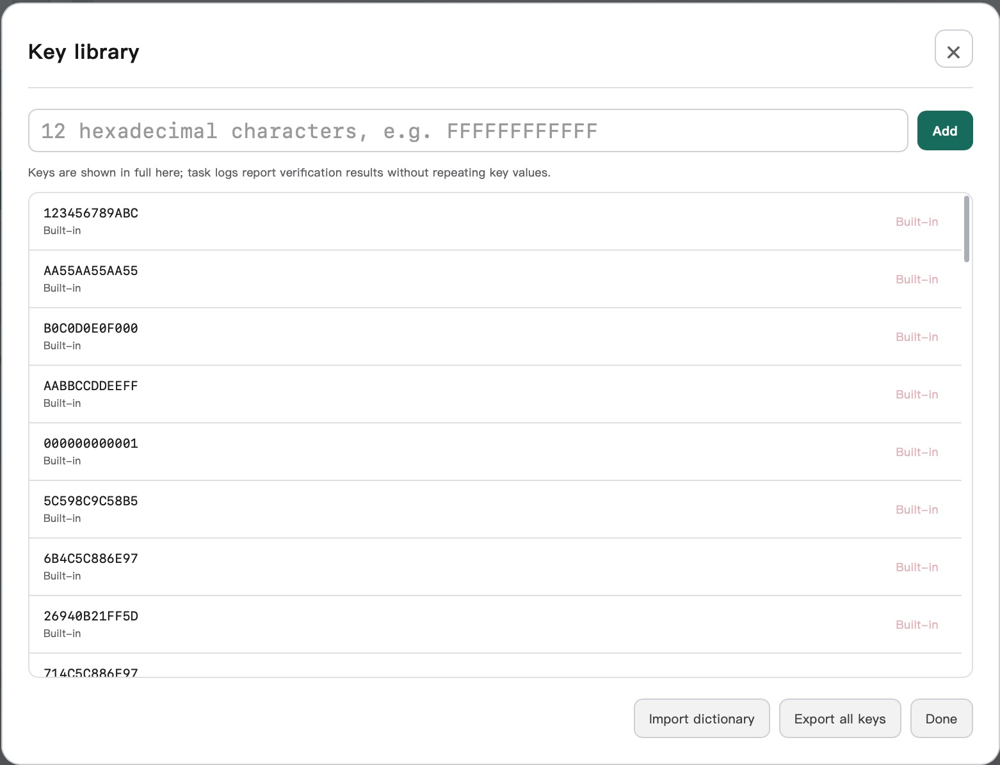

# NFCX

<strong>跨平台、开源、简单易用的 NFC 图形化桌面工具。</strong>

<a href="README.md">English</a> | <a href="README.zh-CN.md">简体中文</a>

NFCX 将读卡器发现、卡片信息、读取、受保护写入、原始 dump、密钥管理和恢复流程集中到一个 macOS、Windows 与 Linux 桌面应用中，适用于你拥有或获准测试的 MIFARE Classic 卡片。

市面上缺少这类真正跨平台的 NFC 图形化应用；NFCX 坚持开源，并用清晰、直接的 GUI 让 NFC 操作不再依赖零散的命令行工具。

官网：[nfcx.tools](https://nfcx.tools) · 下载：[GitHub Releases](https://github.com/BennyThink/NFCX/releases)

# NFCX 能做什么

- 发现并连接 NFC 读卡器
- 检测卡片并显示 UID、ATQA、SAK 与卡片类型。
- 操作 MIFARE Classic 1K：使用 Key A/Key B 认证、读 block、编辑数据及写入变更。
- 保存和加载兼容的原始 dump（`.bin` / `.mfd`）及并列元数据；恢复时执行容量、BCC、访问控制位和逐块回读检查。
- 扫描常见密钥，并管理本地密钥目录。
- 在已验证的 PN532 UART 读卡器上运行集成恢复流程：常见密钥、Darkside、Nested、Hardnested 与读取验证。
- 对支持的 CUID/Gen2 和 Gen1A 卡片执行受保护的 4-byte UID/block 0 流程。 

# 支持的读卡器

| 读卡器 | 连接 / 后端 | 状态 | 平台 |
| --- | --- | --- | --- |
| PN532 + FT232RL | 串口，通过 libnfc `pn532_uart` | **已测试**：发现、Classic 读写、dump/restore 与密钥恢复 | macOS、Windows、Linux 构建 |
| 其他 PN532 UART 适配器 | 串口，通过 libnfc `pn532_uart` | **预期兼容**，尚未由本项目硬件测试 | 取决于适配器驱动和串口权限 |
| ACR122U | USB / PC/SC 或 libnfc | **当前版本不支持**：未完成 NFCX 硬件验证，也未启用发布配置 | — |
| ACR1552U | USB / 厂商 PC/SC 驱动 | **当前版本不支持**：未完成 NFCX 硬件验证，也未启用发布配置 | — |
| 其他 libnfc 设备 | 因设备而异 | 在获得明确 NFCX 验证配置前均为**不支持** | — |

# 驱动和运行要求

NFCX 自带 NFC 运行时；不需要另外安装 libnfc、mfoc、mfcuk 或命令行 NFC 工具。

- Linux：当前账户通常需要获得串口读写权限（常见为 `dialout` 组）。例如：`sudo usermod -aG dialout $USER`；重新登录后生效。也可以在明确了解风险的前提下，以 `sudo` 运行。
- macOS：未签名版本可能显示 Gatekeeper 警告；可在“系统设置 → 隐私与安全性”中按提示允许打开。 
- Windows：启动 NFCX 可能需要先安装请安装 [FTDI 虚拟串口驱动](https://ftdichip.com/drivers/)

# 下载和安装

1. 打开 [GitHub Releases](https://github.com/BennyThink/NFCX/releases)。
2. 下载适合你操作系统的安装包或压缩包。
3. 安装或解压；必要时安装读卡器驱动。
4. 连接读卡器并启动 NFCX。

# 快速开始

1. 连接 NFC 读卡器并启动 NFCX。
2. 刷新读卡器列表，或输入 PN532 UART connstring。
3. 将获授权卡片放在读卡器上，选择 **Scan Card**。
4. 查看卡片信息，再按需使用 **恢复密钥**、**读卡**、**修改 UID** 等功能。

 
# 软件截图

## 主界面

## 密钥管理

# 隐私和匿名遥测

匿名遥测完全可选。首次启动时可以选择是否启用，之后也能随时在 **关于** 中更改。
启用后，NFCX 只发送匿名安装标识、NFCX 版本、粗粒度操作系统类型、白名单功能事件和事件时间，用于了解功能使用情况与平台分布。

NFCX **不会**采集卡片 UID、Key A/Key B、dump、卡片内容、读卡器标识、用户名、设备名、Machine ID、文件路径、日志、IP 地址或其他个人信息。
收集端不会保留原始请求头或 IP 数据。实现细节见[遥测规格](docs/specs/14-telemetry.md)。

# 许可证与第三方软件

NFCX 源码使用 [MIT License](LICENSE)。
NFCX 会动态链接 LGPL-3.0-or-later 的 libnfc，并重新分发独立的 GPL-2.0-or-later 密钥恢复可执行文件（mfoc、mfcuk、mfoc-hardnested），以及 BSD-2-Clause 的 `nfc-mfsetuid` 工具。
这些均为独立许可的软件；发布包包含其 notice、源码位置、固定版本与 NFCX 补丁。

重新分发 NFCX 或其运行时前，请阅读 [THIRD_PARTY_NOTICES.md](THIRD_PARTY_NOTICES.md)。

# 项目链接

- [官网](https://nfcx.tools)
- [GitHub 仓库](https://github.com/BennyThink/NFCX)
- [下载发布版](https://github.com/BennyThink/NFCX/releases)
- [文档索引](docs/README.md)

请仅将 NFCX 用于你拥有或获得明确授权测试的卡片和系统。

# LICENSE
MIT