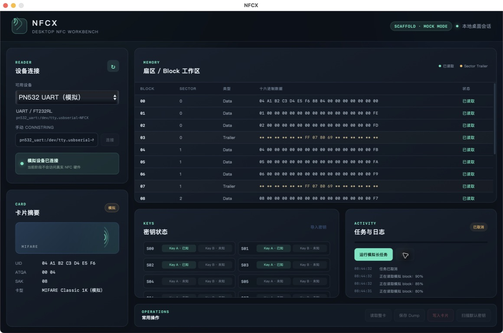

# 规格 01 验收证据

验收平台：macOS 14.7.8 arm64  
验收日期：2026-09-12

## 工具版本

```text
go version go1.25.1 darwin/arm64
Wails CLI v2.15.0
node v24.16.0
npm 11.13.0
```

## Go 自动化测试

命令：

```sh
go test ./...
```

结果：

```text
?    github.com/BennyThink/NFCX                         [no test files]
ok   github.com/BennyThink/NFCX/app                     0.345s
?    github.com/BennyThink/NFCX/cmd/nfcx                [no test files]
?    github.com/BennyThink/NFCX/internal/attack         [no test files]
?    github.com/BennyThink/NFCX/internal/desktop        [no test files]
?    github.com/BennyThink/NFCX/internal/device         [no test files]
?    github.com/BennyThink/NFCX/internal/mifare         [no test files]
?    github.com/BennyThink/NFCX/internal/nfc            [no test files]
?    github.com/BennyThink/NFCX/internal/workflow       [no test files]
```

额外执行 `go test -race ./app`，结果：

```text
ok   github.com/BennyThink/NFCX/app   1.410s
```

`go vet ./...` 通过且无输出。

## Wails 开发模式

命令：

```sh
wails dev
```

关键输出：

```text
• Generating bindings: Done.
• Installing frontend dependencies: Done.
• Compiling frontend: Done.
VITE v7.3.6 ready
• Compiling application: Done.
• Packaging application: Done.
• Self-signing application: Done.
Using Frontend DevServer URL: http://localhost:5173/
```

开发窗口成功打开并显示模拟设备及卡片数据；验收后已正常停止开发进程。

## 前端生产构建

命令：

```sh
npm run build
```

结果：

```text
vite v7.3.6 building client environment for production...
✓ 6 modules transformed.
dist/index.html                  0.44 kB │ gzip: 0.28 kB
dist/assets/index-BB2b-REP.css  10.38 kB │ gzip: 3.24 kB
dist/assets/index-BZvsx88r.js    9.56 kB │ gzip: 3.48 kB
✓ built in 90ms
```

## Wails 生产构建

最终复验直接使用标准命令；Wails 会在 macOS 构建过程中自动设置所需 framework 链接参数：

```sh
wails build
```

关键输出：

```text
# Building target: darwin/arm64
• Generating bindings: Done.
• Installing frontend dependencies: Done.
• Compiling frontend: Done.
• Compiling application: Done.
• Packaging application: Done.
• Self-signing application: Done.
Built 'build/bin/NFCX.app/Contents/MacOS/NFCX'.
```

产物通过 `codesign --verify --deep --strict` 校验；可执行文件为 arm64 Mach-O，应用使用 ad-hoc 自签名。

## 窗口与取消验收

生产应用显示模拟设备、卡片摘要、block 工作区、密钥状态、操作区以及任务日志。启动模拟长任务后进度持续更新；点击取消后界面恢复可交互状态并显示“已取消”，后续没有完成事件。


